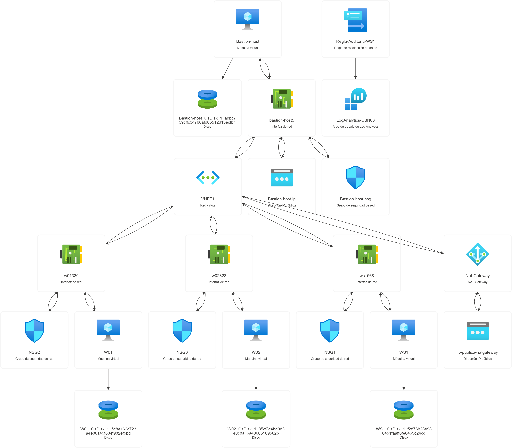

# Laboratorio de Active Directory en Azure con Integración SIEM (Capa Gratuita)

Este proyecto documenta el despliegue completo de un entorno de **Active Directory Domain Services (AD DS)** en Microsoft Azure, diseñado para operar estrictamente dentro de los límites de la capa gratuita (200 créditos). 

El entorno está pensado como un campo de pruebas para simulaciones de ciberseguridad (Red/Blue Teaming), permitiendo la ejecución de ataques (pivoting, explotación de AD) y la recolección centralizada de telemetría de seguridad mediante la ingesta de logs en **Azure Log Analytics**.

## 🎯 Objetivos del Proyecto
* **Despliegue Seguro en la Nube:** Creación de una arquitectura de red aislada utilizando un Jump Server (Bastion Host) y un NAT Gateway para salida a internet sin exposición de IPs públicas.
* **Administración de Identidades:** Configuración de un Controlador de Dominio (Windows Server 2022) y unión de estaciones de trabajo (Windows 10) al dominio `Contoso2.corp`.
* **Auditoría y Monitoreo (SIEM):** Implementación de políticas de grupo (GPOs) para la auditoría de eventos críticos (Logon/Logoff, creación de cuentas) y su reenvío a un Workspace de Log Analytics mediante Data Collection Rules (DCR) y el Azure Monitor Agent (AMA).

## 🏗️ Arquitectura de la Infraestructura
A continuación, se presenta el mapa de topología de los recursos desplegados en Azure, mostrando la relación entre la red virtual, las interfaces de red, los grupos de seguridad (NSG) y el recolector de logs.

El laboratorio consta de los siguientes componentes dentro de la VNet (`10.0.0.0/16`):

| Hostname | Rol | SO | IP Privada | Exposición |
| :--- | :--- | :--- | :--- | :--- |
| **Bastion Host** | Jump Server / Punto de entrada | Windows 10 Ent. | DHCP | IP Pública (RDP - 3389) |
| **WS1** | Domain Controller (DNS/AD DS) | Windows Server 2022 | `10.0.2.100` | Interna (Aislada) |
| **W01** | Workstation (Unida al Dominio) | Windows 10 Ent. | `10.0.2.10` | Interna (Aislada) |
| **W02** | Workstation (Unida al Dominio) | Windows 10 Ent. | `10.0.2.20` | Interna (Aislada) |

*Nota: La salida a internet para el DC y las estaciones de trabajo se gestiona de forma segura a través de un NAT Gateway.*

## 🛠️ Tecnologías y Herramientas Utilizadas
* **Microsoft Azure:** Máquinas Virtuales (tamaño `Standard_DC1s_v3`), VNet, Subnets, NSGs, NAT Gateway.
* **Sistemas Operativos:** Windows Server 2022 Datacenter, Windows 10 Enterprise (22H2).
* **Seguridad y Monitoreo:** Azure Log Analytics Workspace, Azure Monitor Agent (AMA), Kusto Query Language (KQL), Group Policy Objects (GPO).

## 🚀 Guía de Implementación Paso a Paso

Todo el proceso de construcción, desde la configuración de la red hasta la ejecución de consultas KQL para la validación de eventos, está detallado en nuestra guía principal.

👉 **[Ver la Guía de Despliegue Completa](./Implementacion_paso_A_paso/README.md)**

## 🔍 Casos de Uso (Próximos Pasos)
Este entorno base está listo para:
* Prácticas de explotación de Active Directory (Kerberoasting, AS-REP Roasting).
* Análisis de artefactos y detección de anomalías (Threat Hunting).
* Integración futura de herramientas de recolección de logs adicionales u otros SIEMs.

## 📜 Infraestructura como Código (Terraform)

Para facilitar el despliegue rápido y la comprensión de los recursos a nivel de código, este repositorio incluye la configuración de la infraestructura en **Terraform** (archivo `main.tf`). 

Este código está preparado para levantar la arquitectura base o "dura" de la topología (VNet, Subnets, NAT Gateway, NSGs y Máquinas Virtuales). La configuración del SIEM y la unión al dominio se realizan posteriormente siguiendo la guía de implementación.

### ⚙️ Cómo utilizar la plantilla de Terraform:
Si deseas levantar este laboratorio automatizado, asegúrate de modificar los siguientes valores en el archivo `main.tf` antes de ejecutar `terraform apply`:

1. **ID de Suscripción:** Busca la cadena de enmascaramiento `xxxxxxxx-xxxx-xxxx-xxxx-xxxxxxxxxxxx` y reemplázala por el ID de tu suscripción real de Azure.
2. **Credenciales:** Los campos `admin_password` han sido vaciados por seguridad. Deberás asignar una contraseña segura para el administrador en cada bloque de máquina virtual.
3. **Ajuste de Tamaños (Opcional):** Verifica que el tamaño de las VMs (`Standard_DC1s_v3`) esté disponible en tu región de Azure y se ajuste a los créditos de tu capa gratuita.
