# DOCUMENTACION
## Maquinas
Para este laboratorio se utilizarán las siguientes máquinas en VMware:

* **Máquina Kali Linux**: Máquina atacante
* **Máquina Ubuntu**: Servidor donde se alojará Shuffle
* **Servidor Wazuh**: SIEM para la recolección de eventos
* **Máquina Windows 10**: Máquina víctima


## Shuffle

En mi caso usare una maquina ubuntu en vmware para instalarlo

Paso 1: Actualizar el sistema
Antes de instalar nada, siempre le decimos a Ubuntu que busque las últimas versiones de todo:

```bash
sudo apt update && sudo apt upgrade -y
```

Paso 2: Instalar Docker y Docker Compose. Estas herramientas son necesarias para instalar el motor de contenedores y orquestar Shuffle

```bash
sudo apt install docker.io docker-compose -y
```
Paso 3: Asignar permisos al usuario. Para evitar escribir sudo en cada ejecución, agrega tu usuario al grupo de Docker. Es necesario cerrar la sesión y volver a entrar, o reiniciar la máquina (usando sudo reboot) para aplicar los cambios

```bash
sudo usermod -aG docker $USER
```

¡Y listo! Ya podrías instalar Shuffle
Una vez que tu Ubuntu se reinicie, instalar Shuffle toma solo dos comandos más:

Descargas Shuffle:

```bash
git clone https://github.com/Shuffle/Shuffle
```

Lo enciendes:

```bash
cd Shuffle
sudo docker compose up -d
```

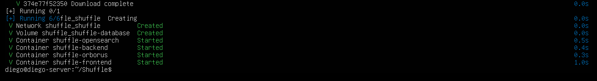

veremos en que puerto esta alojado:

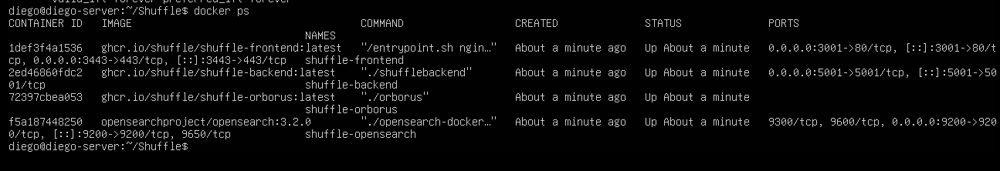

Una vez reiniciado, descarga y enciende Shuffle, aparecerán varias interfaces de red (debido a Docker); usa la terminal para ver la IP de tu máquina Ubuntu

Shuffle se alojará en el puerto 3443 (por ejemplo, si la IP es 172.16.1.7, la interfaz de Shuffle estará en https://172.16.1.7:3443)

```bash
ip -br a
```
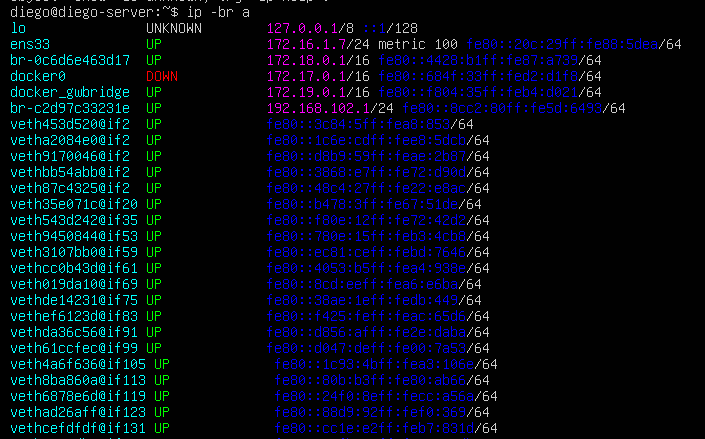


```bash
https://[colocar tu ip:puerto]/login
# en mi caso
https://172.16.1.7:3443/login
```

Crearemos nuestro proyecto

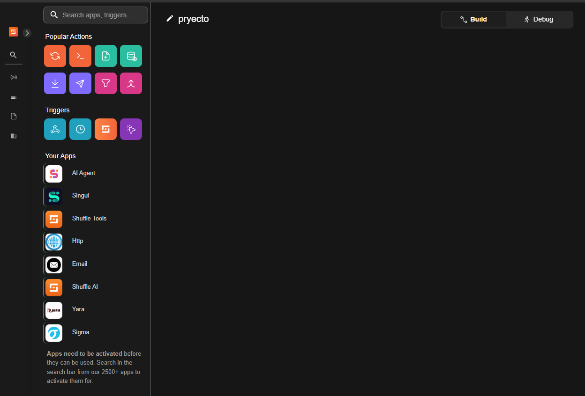

## Integracion con Wazuh

En el lienzo arrastramos un webhook (la que parece un spinner), **Importante anotar la URL, al momento de hacer la prueba darle a "Start"**

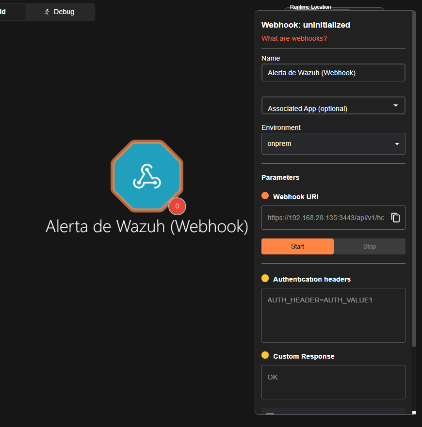

### Despliege de Wazuh

* Usuario: wazuh-user
* Contraseña: wazuh

En la terminal, buscaremos nuestra ip, y la buscaremos en el navegador, en mi caso https://172.16.1.8/app/login?

```bash
ip a
```

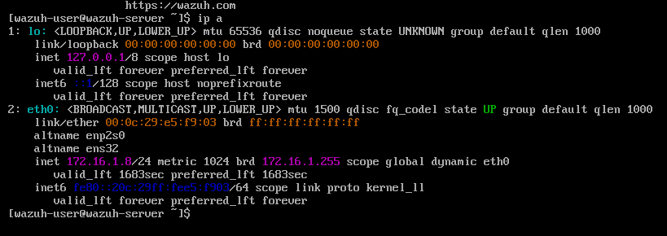

Ahora en Wazuh, las credenciales del portal web por defecto seran:

* usuario: admin
* contraseña: admin

desplazar el panel derecho ir a **server management>settings>edit configuration (esquina izquierda)**

Entre **global y alerts**, agregar la integracion y darle a guardar

* **IMPORTANTE!!**, Si al probar la conexión la alerta no llega a Shuffle, cambia la URL a formato http y usa el puerto 3001 (Shuffle internamente enruta los webhooks por el 3001 sin SSL por defecto en su arquitectura de contenedores) en la etiqueta <hook_url>

* **IMPORTANTE**, Puesto que más adelante se incorporará una IA con tokens limitados, configura la alerta para un nivel específico (ejemplo, nivel 6 para ataques de fuerza bruta) para evitar consumir los tokens con cada log regular

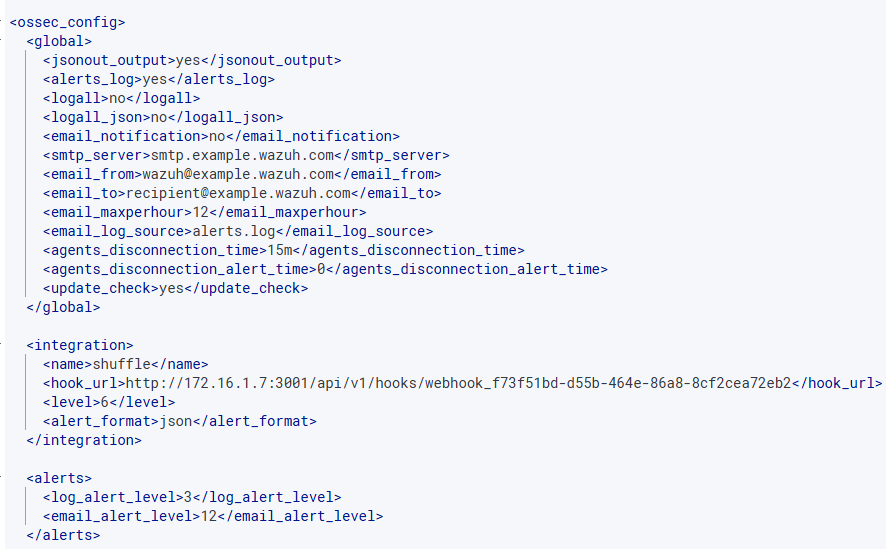

```bash
  <integration>
    <name>shuffle</name>
    <hook_url>http://172.16.1.7:3001/api/v1/hooks/webhook_f73f51bd-d55b-464e-86a8-8cf2cea72eb2</hook_url>
    <level>6</level>
    <alert_format>json</alert_format>
  </integration>
```

### Despliegue del Agente en Windows 10

En el wazuh

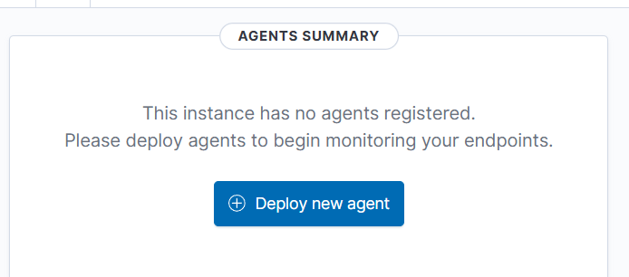

* Selecciona el sistema operativo Windows en Wazuh
* En **Server address**, coloca la IP de Wazuh para que el agente sepa a quién reportar
* En el tercer apartado opcional, podemos poner un nombre al agente

Aparecera un codigo para descargar el agente, y como iniciarlo

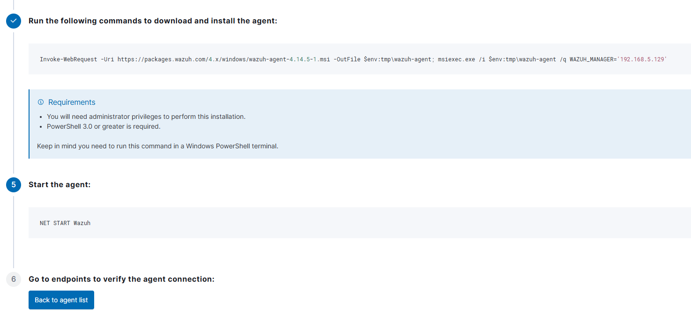

Abrimos la powershell como administrador en nuestra maquina windows y ejecutamos los comandos que nos dio el wazuh, en mi caso:

```bash
Invoke-WebRequest -Uri https://packages.wazuh.com/4.x/windows/wazuh-agent-4.14.5-1.msi -OutFile $env:tmp\wazuh-agent; msiexec.exe /i $env:tmp\wazuh-agent /q WAZUH_MANAGER='172.16.1.8' 
```

```bash
NET START Wazuh
```

Y volviendo al panel de wazuh veremos que tendremos el agente

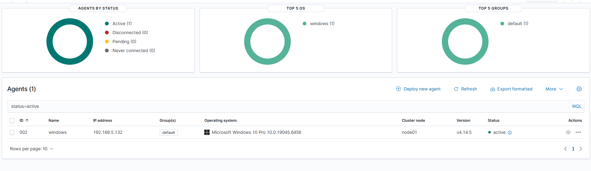

### Probando la conexion con shaffle

Veremos las ip de nuestra maquina windows con "ipconfig", 

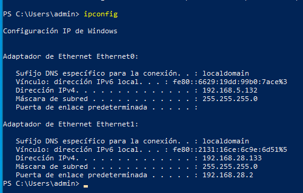


### Llegada al shuffle

En la máquina windows en mi caso tiene una cuenta con credenciales
* usuario: admin
* contraseña: Sistemas2026! 

Si no tiene contraseña , abrir el powershell y ejecutar
```bash
net user admin Sistemas2026!
```

En la máquina kali crearemos un diccionario de contraseñas
```bash
nano passwords.txt

# Contraseñas a colocar
123456
admin
password
qwerty
Sistemas2026! # Cambiar por la de su maquina

```
Ejecutamos el ataque
```bash
nxc smb 172.16.1.9 -u admin -p passwords.txt
```

En el shuffle (**Recordarle haber dado a start**), se veran los logs

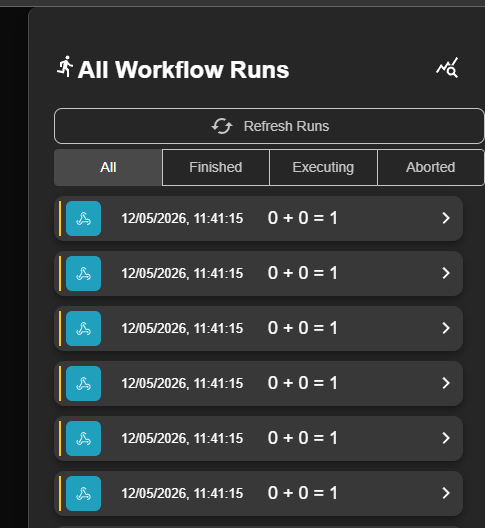

## Construccion

### Nodo Jira (Gestión de Tickets)

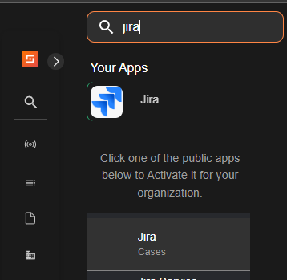

Ahora integraremos lo mas parecido a una ticketera, en mi caso jira, ya que sera un servicio SaaS, The hive puede ser una opcion pero requerira mas RAM de mi PC, y al tener todo encendido me consume casi toda mi RAM (32 GB)

Crearse una cuenta en jira en "https://www.atlassian.com/es/software/jira" y despues generarse una API

* Como usuario, usar el correo electronico que se uso al crear la cuenta
* En password colocar la API
* En la URL, se ecuentra en la apgina de jira

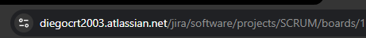

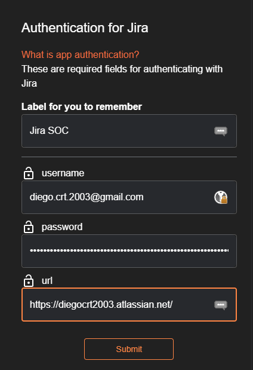

En jira iremos a la seccion de **"post create issue"**

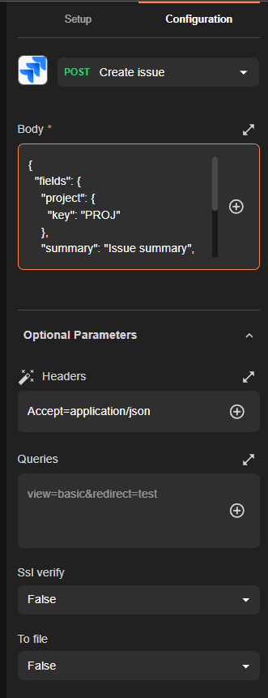

**IMPORTANTE** Debes construir correctamente el body y los headers en Shuffle para que Jira acepte los parámetros que le envíes desde el Webhook, en mi caso uso el siguiente en "Body":

```bash
{
  "fields": {
    "project": {
      "key": "SOP"
    },
    "summary": "[Lvl $exec.all_fields.rule.level] $exec.all_fields.rule.description",
    "description": {
      "type": "doc",
      "version": 1,
      "content": [
        {
          "type": "paragraph",
          "content": [
            {
              "type": "text",
              "text": "Se ha detectado una alerta de seguridad desde Wazuh. A continuación los detalles básicos para el inicio de la investigación:"
            }
          ]
        },
        {
          "type": "bulletList",
          "content": [
            {
              "type": "listItem",
              "content": [
                {
                  "type": "paragraph",
                  "content": [
                    {
                      "type": "text",
                      "text": "Agente afectado: $exec.all_fields.agent.name"
                    }
                  ]
                }
              ]
            },
            {
              "type": "listItem",
              "content": [
                {
                  "type": "paragraph",
                  "content": [
                    {
                      "type": "text",
                      "text": "IP del Agente: $exec.all_fields.agent.ip"
                    }
                  ]
                }
              ]
            },
            {
              "type": "listItem",
              "content": [
                {
                  "type": "paragraph",
                  "content": [
                    {
                      "type": "text",
                      "text": "Regla ID: $exec.all_fields.rule.id"
                    }
                  ]
                }
              ]
            },
            {
              "type": "listItem",
              "content": [
                {
                  "type": "paragraph",
                  "content": [
                    {
                      "type": "text",
                      "text": "Fecha del evento: $exec.timestamp"
                    }
                  ]
                }
              ]
            }
          ]
        }
      ]
    },
    "issuetype": {
      "name": "Task"
    }
  }
}
```

En headers pondremos

```bash
{"Content-Type": "application/json"}
```

### Nodo HTTP (Integración con Gemini AI)

Ya con el webhook funcionando, se arrastrara un HTTP para integrar gemini

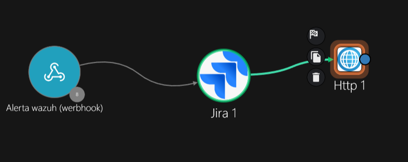

Crearemos un clave API en :https://aistudio.google.com/app/api-keys?projectFilter=gen-lang-client-0609086102

En la configuracion del Htpp de shaffle, cambiamo a **POST**, usare en mi caso el modelo "gemini-2.5-flash", tiene tokens limitadospero suficientes para demostraciones


Url: https://generativelanguage.googleapis.com/v1beta/models/gemini-2.5-flash:generateContent?key=TU_CLAVE_API

En el Body usaremos un prompt, en mi caso:
```bash
{
  "contents": [
    {
      "parts": [
        {
          "text": "Actúa como un analista SOC experto. Analiza la siguiente alerta de seguridad detectada por Wazuh y genera un reporte técnico para una investigación.<br><br>Alerta: $exec.all_fields.rule.description<br>Host afectado: $exec.all_fields.agent.name<br>IP del Host: $exec.all_fields.agent.ip<br>Regla de Wazuh: $exec.all_fields.rule.id<br><br>Por favor, explica qu&eacute; significa esta alerta, cu&aacute;les podr&iacute;an ser las causas y recomienda los siguientes pasos a seguir.<br><br>IMPORTANTE:<br>- Genera tu respuesta directamente en formato HTML puro.<br>- Usa etiquetas HTML como &lt;br&gt;, &lt;b&gt;, &lt;h3&gt; y &lt;ul&gt;.<br>- DEBES usar entidades HTML para acentos y la letra &ntilde;.<br>- PROHIBIDO usar saltos de l&iacute;nea '\\n'.<br>- Usa &uacute;nicamente etiquetas HTML para el formato.<br>- No uses bloques markdown.<br>- Devuelve solamente el HTML limpio."
        }
      ]
    }
  ]
}
```
En Header colocamos:

```bash
{"Content-Type": "application/json"}
```

En timeout, poner 60-120 aprox

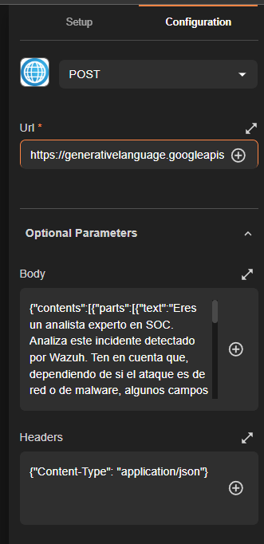

Para saber los modelos de IA, podemos ejecutar en nuestro kali, Por si queremos cambiar de modelo, en mi caso escogi "gemini-2.5-flash", o sino probar el "gemma-4-26b-a4b-it" (que tambien me funciono pero es mas lento)

```bash
curl -s "https://generativelanguage.googleapis.com/v1beta/models?key=TU_CLAVE_API" | grep '"name"'
```

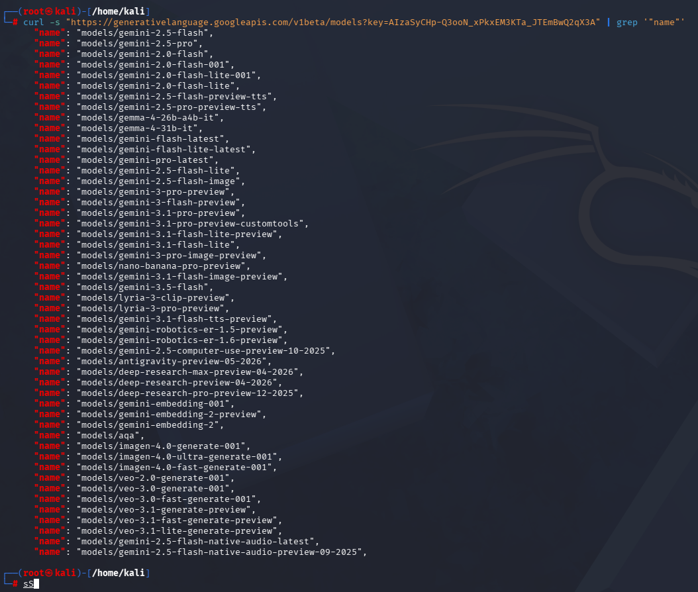

### Nodo Email

El ticket creado tendrá datos básicos, por lo que usaremos el nodo HTTP para que la IA lea el log completo y envíe un reporte detallado al correo del analista de turno

Arrastraremos al lienzo email y lo unimos al http

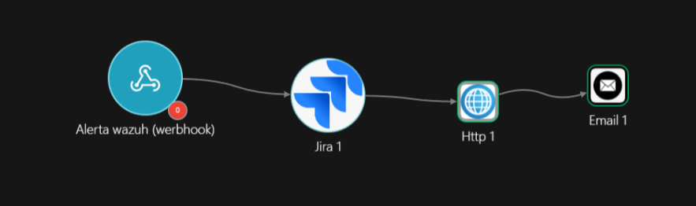

Cambio a **Send email smtp** y en los campos pondremos:

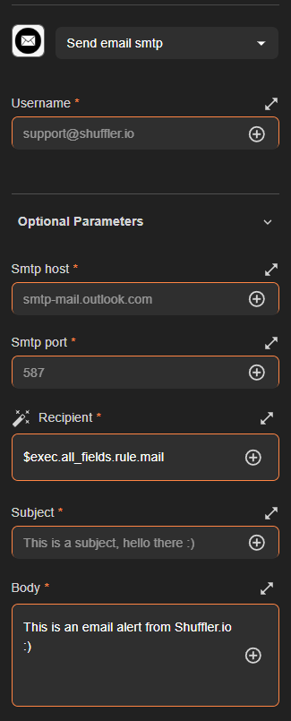

1. **Username**: Escribe el email completo de la persona que enviara el correo al analista
2. **Password**: al darle en (opcional parameters): debes ir a "https://myaccount.google.com/"
  * Despues a seguridad y acceso
  * en su buscador poner "contraseñas de aplicaciones"
  * Pones un nombre, y la contraseña que te genere es la que pondras en el campo password de email en el shuffle

3. **Smtp host**: smtp.gmail.com
4. **Smtp port**: 587
5. **Recipient**: pone el correo de la persona a la que le llegara, en mi escenario sera le analista
6. **cc emails**: vacio
7. **Subject**: Sera el mensaje que le llegara al correo del analista, tendremos que poner la respuesta que nos de la IA del nodo http, **En mi caso lo adapte poniendo '0' en ves de '#'**:
   
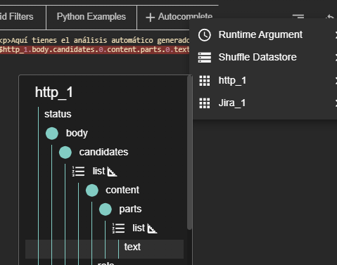

```bash
<p>Aquí tienes el análisis automático generado por IA:</p>
$http_1.body.candidates.0.content.parts.0.text
```
8. Ssl veryfy: dejar en True
9. body type: Poner Html, puede depender de en que formato especifiques en el prompt del nodo http

# Demostración

1. Ya con todo integrado, verificaremos el log, en el webhook, le damos a start

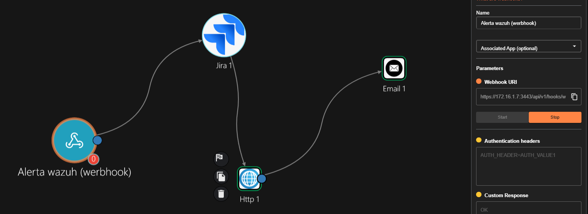

2. En el kali, lanzamos un ataque de fuerza bruta, (ajustar en nivel en el wazuh, en mi caso puse 6)

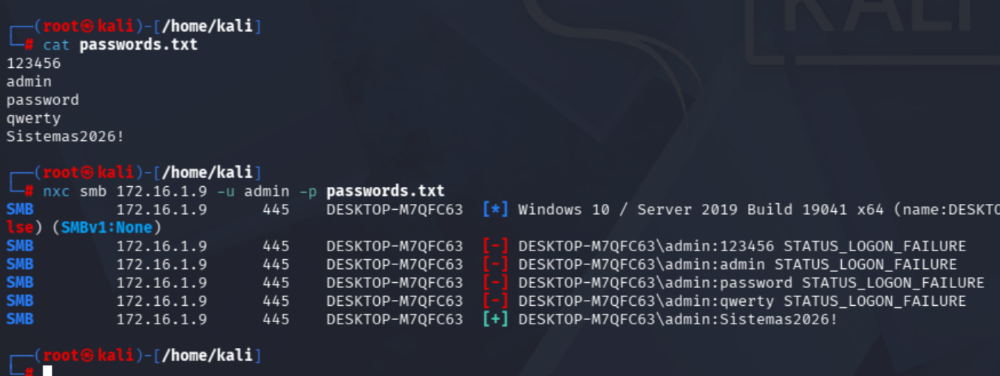

* Llegan los logs al shuffle

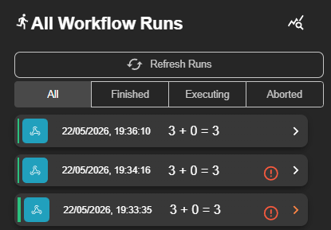

3. Al pasar por jira, se crean los tickets (en mi caso que hice muchas pruebas en la construccion por ello llega empezando con la numeracion 32, 33 , 34)

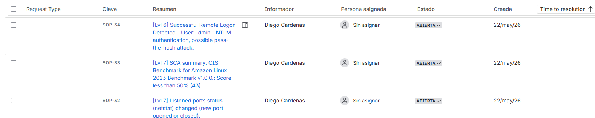

* Abriendo SOP-34

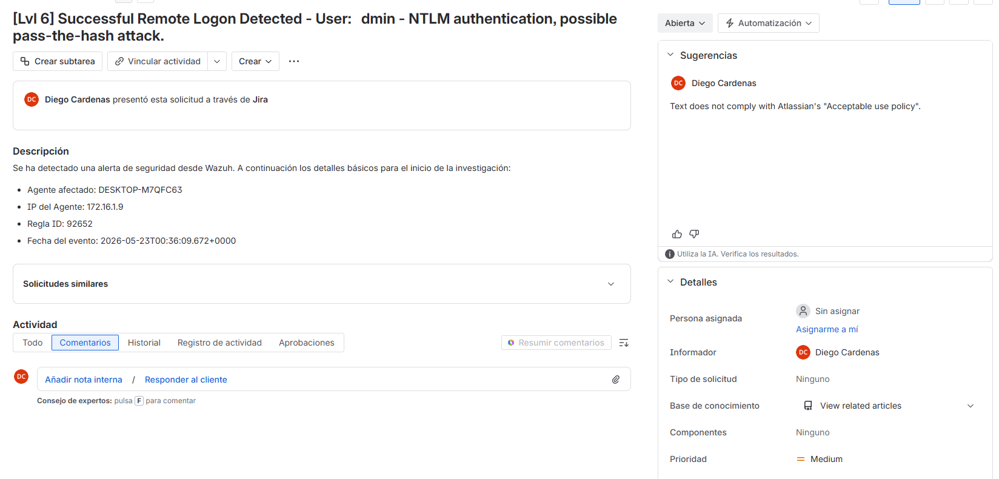

4. Pasa por el nodo http, donde la IA analiza el log y genera un reporte y tal reporte se envia al correo del analista

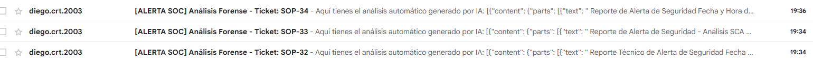

* Reporte de SOP-34

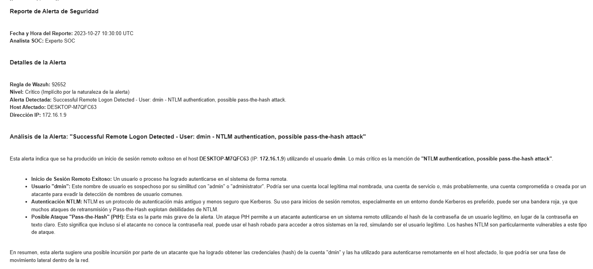
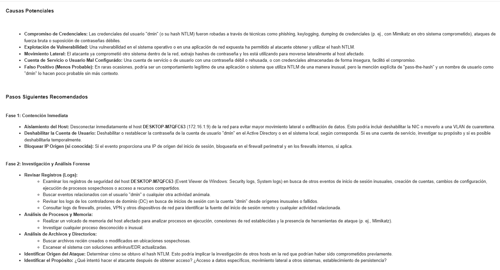
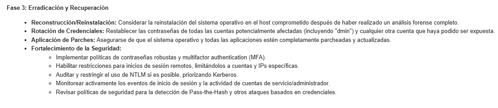


